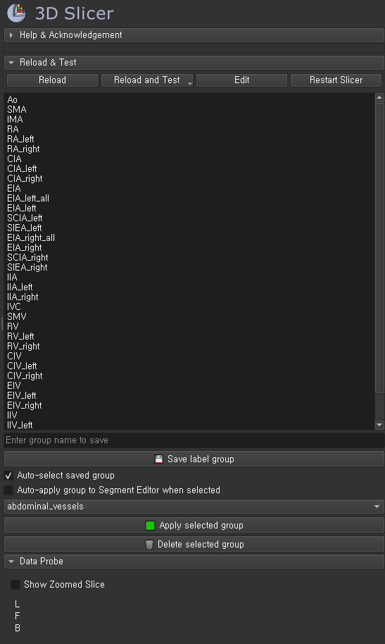
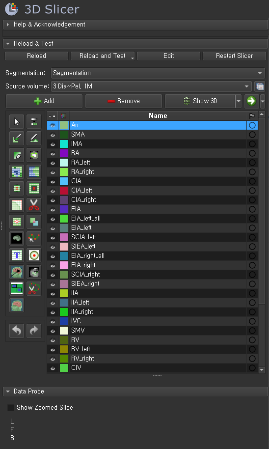
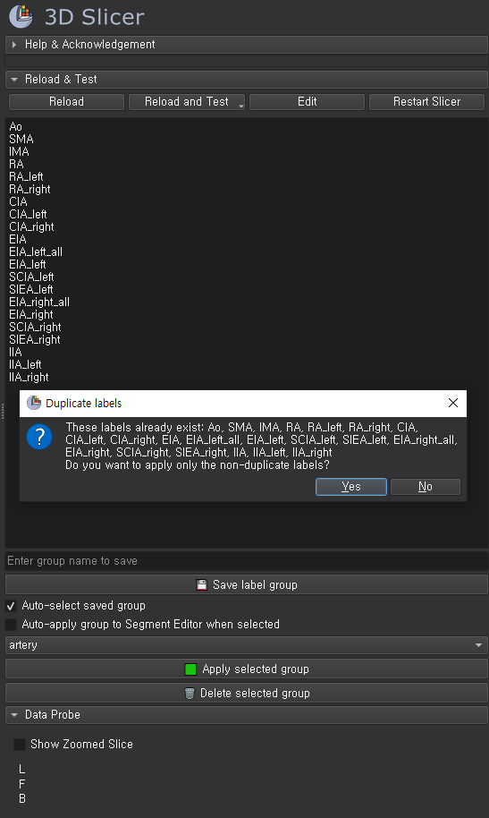

# LabelNameGenerator

A simple 3D Slicer extension to create, save, and manage label groups with random colors for segmentation.

## Features

- Input multiple label names and save them as reusable groups
- Automatically assign random colors to each label upon creation
- Apply saved groups directly to the Segment Editor
- Detect and avoid duplicated labels before applying
- Auto-select or auto-apply label groups when selected

## Preview

| Description | Screenshot |
|-------------|------------|
| **1. Label group editor UI**   Checkboxes for selecting multiple labels and saving to a group |  |
| **2. Group applied to Segment Editor**   Labels are added with pre-assigned colors |  |
| **3. Duplicate label warning**   Alerts if labels already exist in the Segment Editor |  |

## How to Use

1. Select multiple labels using checkboxes
2. Enter a group name and click **Save label group**
3. From the dropdown, choose a saved group
4. Click **Apply selected group** to add the labels to Segment Editor
5. If a group contains duplicate labels, a warning will appear

## Author

**Eunseo Heo (esheo-skia)**  
GitHub: [esheo-skia](https://github.com/esheo-skia)  
Email: esheo.skia@gmail.com

## License

This project is licensed under the MIT License. See [LICENSE](LICENSE) for details.

