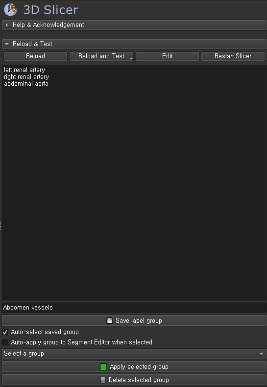
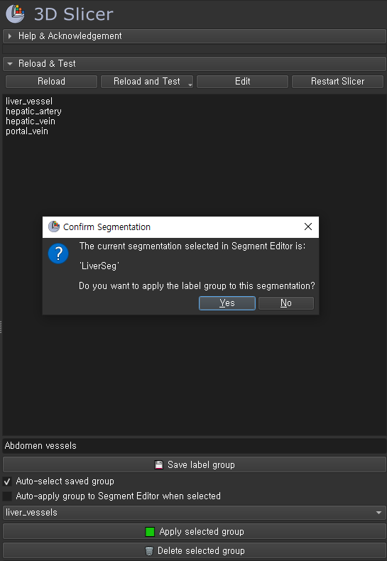
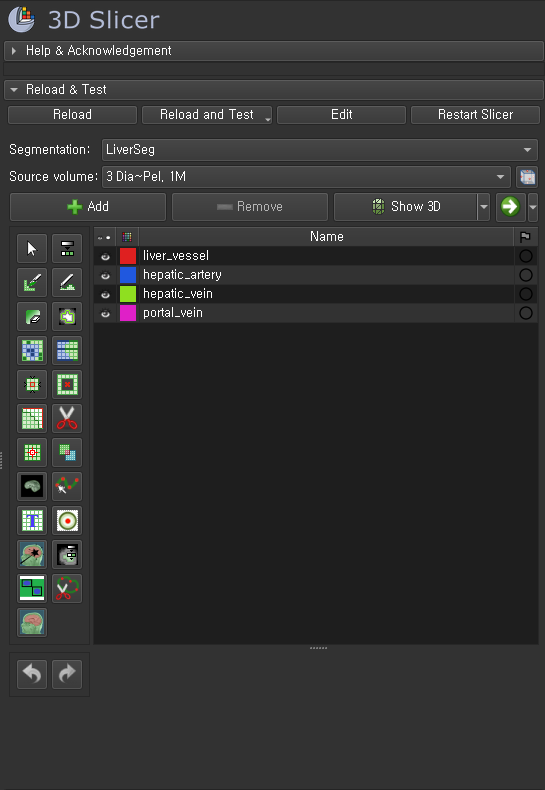

# Segmentation Template Editor

**Segmentation Template Editor** is a 3D Slicer extension that automates repetitive labeling workflows by applying predefined, reusable label groups.  
It ensures **consistent label names, fixed label values, terminology metadata, and visually distinct colors** for every segmentation.


---

##  Quick Demo

 A short overview of the workflow:

- Save a label group
- Apply it to a segmentation node
- View the results in Segment Editor

---

## Features

- **Reusable label groups**  
  Save and reapply standardized label sets across projects.

- **Golden-ratio hue stepping colors**  
  Automatically generates perceptually distinct colors for anatomical clarity.

- **Fixed label value assignment**  
  Ensures consistent integer values across datasets and prevents merge conflicts.

- **Terminology-aware metadata**  
  Applies standard anatomical terminology and color metadata when available.

- **Duplicate detection & conflict handling**  
  Prompts the user to skip or overwrite existing labels safely.

- **CSV Import / Export**  
  Compatible with Slicer-style color table CSV files.

- **Persistent storage**  
  Groups are saved in `labels.json` and persist across sessions.

---

## How to Use

### 1. Enter Labels and Save a Group
- Enter label names line-by-line (e.g., `left renal artery`, `right renal artery`, etc.)
- Input a group name (e.g., `Abdomen vessels`)
- Click `Save label group`



Labels are saved with auto-assigned colors. Duplicate or empty lines are ignored.
Overwrite confirmation is shown if the group already exists.

---

### 2. Apply Group to Segment Editor
- Select a saved group from the dropdown
- Click `Apply selected group`

A confirmation popup will appear showing the current segmentation name.  
This helps avoid accidental application to the wrong segmentation.



If duplicate labels already exist in the segmentation, you’ll be asked whether to skip them.

---

### 3. View Results in Segment Editor
- Newly applied segments will appear with distinct colors
- Colors are assigned using golden-ratio hue spacing to reduce similarity



Segments are automatically linked to the master volume and displayed with their assigned colors.

---

## Installation

### Option 1: Extensions Manager (after merge)

> Recommended: Once published in the Extensions Index, install directly from Slicer.

1. Go to `View > Extensions Manager`
2. Search for `SegTemplateEditor`
3. Click **Install** and restart Slicer

---

### Option 2: Manual Installation (for reviewers & testing)

> For use **before official merge** – useful for collaborators, reviewers, or local testing.

#### Step 1: Download this repository

Clone or download the folder:
```
SegTemplateEditor/
├── SegTemplateEditor.py
└── Resources/
    ├── Icons/
    └── Screenshots/
```

#### Step 2: Register the module in 3D Slicer

1. Launch **3D Slicer**
2. Go to `Edit > Application Settings > Modules`
3. In **Additional module paths**, drag and drop the `SegTemplateEditor` folder  
   *(e.g., `C:/Users/YourName/Desktop/SegTemplateEditor`)*
4. Ensure **Scripted Loadable Modules** is enabled
5. Restart Slicer

 After restart, the module appears under:  
`Modules > Segmentation > Segmentation Template Editor`

---

## Author & License

**Eunseo Heo (esheo-skia)**<br>
*Software Developer — Imaging Tools & Automation*

* **Contact:** [heunseo1787@gmail.com]
* **GitHub:** [https://github.com/esheo-skia]
* **License:** [MIT License](./LICENSE)


